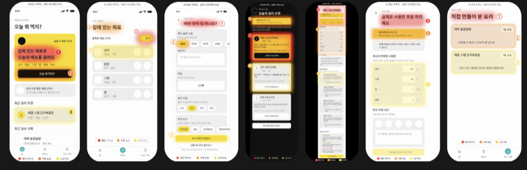

# AI 예상 주목도 맵

AI 예상 주목도 맵은 실제 아이트래킹 데이터가 아니라 화면의 시각적 특성을 바탕으로 만든 예측 시각화입니다.

## 기본 출력

AI 예상 주목도 피드백을 요청하면 텍스트만 제공하지 않고 다음 내용을 함께 제공합니다.

1. 원본 화면 캡처
2. AI 예상 주목도 오버레이
3. 빨강·주황·노랑 주목 영역
4. ① ② ③ 예상 주목 순서
5. 의도한 핵심 요소와 예상 주목 요소 비교
6. 위치·크기·색상·대비 개선 제안

## 출력 예시

> 지난 스킬 만들기 과제로 시작한 **백수저 앱**을 제작하면서, 화면의 시각적 주목도를 점검한 실제 예시입니다. 실제 사용자의 시선을 측정한 결과가 아니라 화면의 크기, 대비, 색상, 위치와 정보 위계를 바탕으로 AI가 예상한 주목도입니다.

## 여러 화면의 처리 기준

- 화면 1개: 자동 분석
- 화면 2~3개: 모두 분석
- 화면 4개 이상: 핵심 화면 3개를 먼저 분석하고 전체 분석 선택 제공
- 영상: 시작·전환·완료 등 핵심 장면 3~5개 추출

긴 스크롤 화면은 전체 페이지 하나보다 실제로 보이는 뷰포트별 분석을 우선합니다.

## 표시 기준

- 빨강: 최우선 예상 주목 영역
- 주황: 높은 예상 주목 영역
- 노랑: 보조 예상 주목 영역
- 숫자: 예상 주목 순서

확률, 체류시간, 실제 사용자 수처럼 오해될 수 있는 수치는 사용하지 않습니다.

## 필수 안내 문구

> 실제 사용자의 시선을 측정한 결과가 아닙니다. 화면의 크기, 대비, 색상, 위치와 정보 위계를 바탕으로 AI가 예측한 주목도입니다.

## 원본과 결과물의 권한

- 제공된 링크나 파일은 현재 요청의 임시 분석에만 사용합니다.
- 분석 요청은 저장, 재배포, 원본 수정 또는 예시 재사용 허락으로 해석하지 않습니다.
- 원본과 생성 이미지는 명시적 허락 없이 Git에 추가하지 않습니다.
- 링크 접근이 제한되면 우회하지 않고 스크린샷 또는 파일 업로드를 안내합니다.
